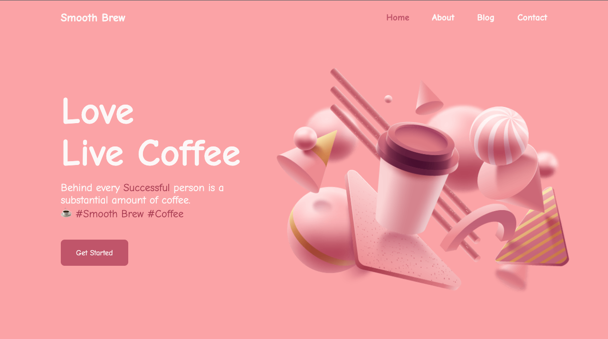
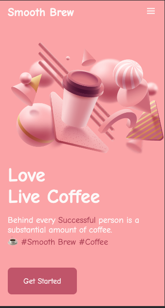

<div align="center">


[](https://twitter.com/Pranav_Jadhav09)
[](https://thejrpranav09.hashnode.dev/master-javascript-scroll-reveal-library-boost-the-user-experience)

<br />
<br />


<h2 align="center">Smooth Brew - Landing Page</h2>
Smooth Brew Coffee Shop is a fully responsive landing page website, responsive for all devices, built using HTML5, CSS3, and JavaScript. Also used GSAP Library to create parallax effects.

<a href="https://pranav-jadhav09.github.io/responsive-coffee-shop-landing-page/"><strong>➥ Live Demo</strong></a>

</div>

<br />

### ☕️ Smooth Berw Coffee Shop

- Made using HTML CSS, JavaScript and GSAP Library.
- Contains GSAP - Parallax animation.
- Developed first with the Mobile First methodology, then for desktop.
- Compatible with all mobile devices and with a beautiful and pleasant user interface.

### Demo Screenshots




### Prerequisites

Before you begin, ensure you have met the following requirements:

- [Git](https://git-scm.com/downloads "Download Git") must be installed on your operating system.

### Run Locally

To run **Smooth Brew Coffee Shop Landing Page**, run this command on your git bash:

Linux and macOS:

```bash
sudo git clone https://github.com/Pranav-Jadhav09/responsive-coffee-shop-landing-page.git
```

Windows:

```bash
git clone https://github.com/Pranav-Jadhav09/responsive-coffee-shop-landing-page.git
```

### License

MIT
